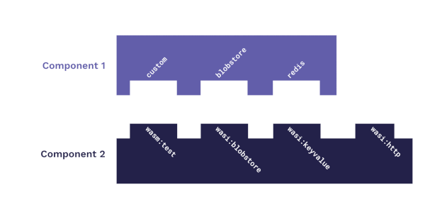
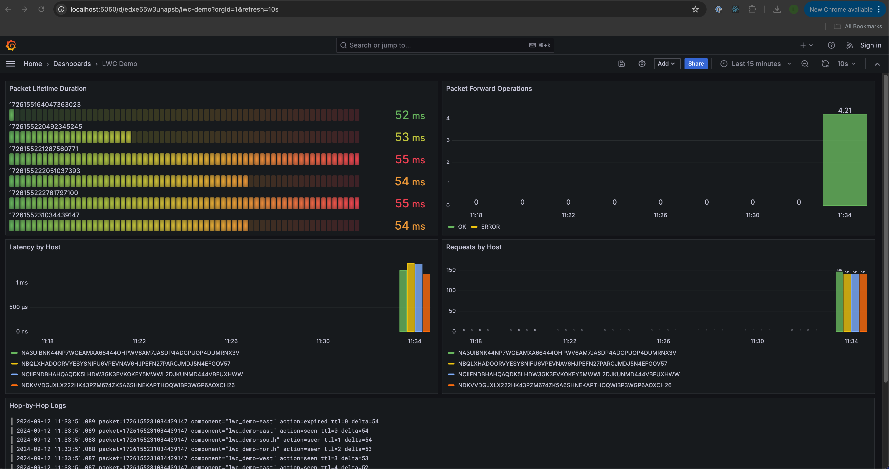

# LWC: Large ~~Hadron~~ WASM Collider

Inject packets in a closed loop system, observing how long it took them to travel hop-by-hop.


## Machinery

### Control-Plane

The Control Plane is a HTTP API Component. It's job is to inject packets into the system and stay out of their way!

### Probes

Probes are situated at different locations ( north, south, east, west). The Probe interface:

```
interface packet-looper {
  process: func(packet: u64, ttl: u64, chaos: u16, route: option<string>);
}

world probe {
  export packet-looper;
  import packet-looper;
}
```

Meaning: Each Probe implements the `packet-looper` interface and also requires another component exporting the same interface.
This pattern is called [Component Composition](https://component-model.bytecodealliance.org/creating-and-consuming/composing.html) and components are usually linked at build time.



One of wasmCloud core features is [Component Linking at Runtime](https://wasmcloud.com/docs/concepts/linking-components/linking-at-runtime), allowing components to:
- Scale and failover independently
- Update components independently
- **Swap implementations dynamically**

This allows implementing Remote Procedure Calls without having to worry about transport or protocols.


## Using it

Bring up the environment:

```
docker-compose up
```

Build & Push control-room & probe components to the docker-compose OCI Registry:

```
./scripts/push.sh
```

Deploy the Application:

```
wash app deploy ./wadm.yaml
```

The Control-Room will be available at http://localhost:30000

TODO(lxf): minimalist UI

Send requests to the Control Room:

```
curl 'localhost:30000/' -i
```

Example:

```
lwc ❯ curl 'localhost:30000/' -i
HTTP/1.1 200 OK
vary: origin, access-control-request-method, access-control-request-headers
access-control-allow-origin: *
access-control-expose-headers: *
transfer-encoding: chunked
date: Thu, 12 Sep 2024 15:32:44 GMT

{"packet":1726155164047363023,"route":"default","ttl":100,"chaos":0}
```

Go to Grafana for results: http://localhost:5050/d/edxe55w3unapsb/lhc-demo




Play with the API! It accepts the following parameters:
- `ttl`: Forward the packet this many times. Default: `100`
- `route`: Pick a path for packets to travel. Possible values: `default | special`. Default: `default`
- `chaos`: Number between 0 - 100 to introduce faults. Default `0`

Example: `curl 'localhost:30000/?ttl=100&chaos=50&route=special' -i`